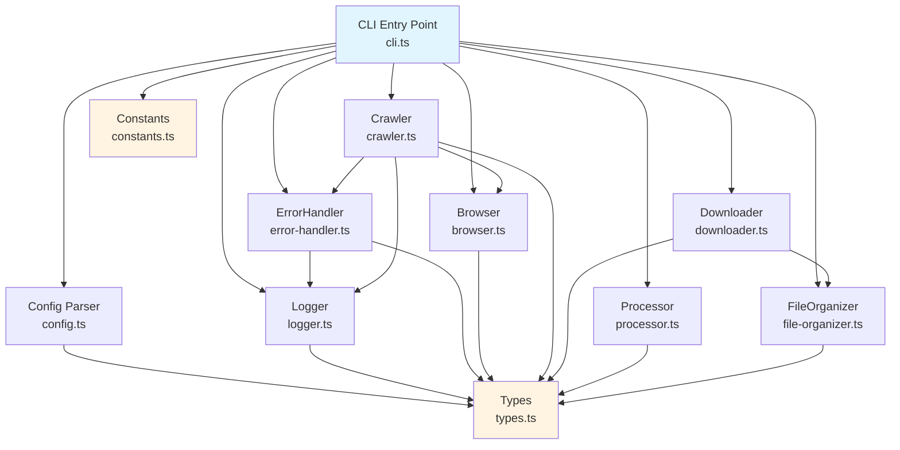
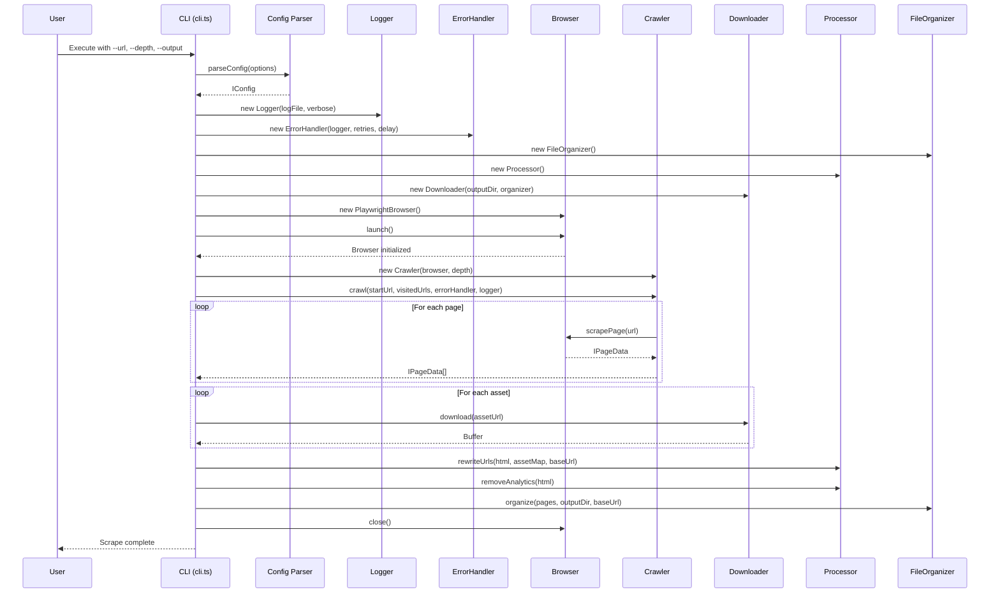
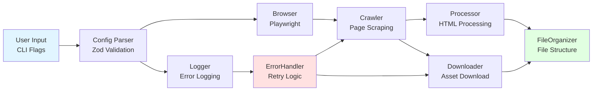
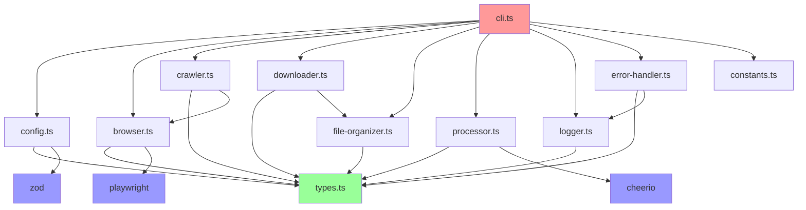

# PlayScrapper - UML Architecture Diagrams

## 1. Component Architecture (Component Diagram)

## 2. Class Diagram (Main Interfaces)

```mermaid
classDiagram
    class IConfig {
        +string targetUrl
        +number depth
        +string outputDir
    }

    class IPageData {
        +string url
        +string html
        +IAsset[] assets
    }

    class IAsset {
        +string url
        +AssetType type
    }

    class IBrowser {
        <<interface>>
        +launch() Promise~void~
        +scrapePage(url: string) Promise~IPageData~
        +close() Promise~void~
    }

    class IDownloader {
        <<interface>>
        +download(url: string) Promise~Buffer~
        +getLocalPath(url: string) string
    }

    class IProcessor {
        <<interface>>
        +rewriteUrls(html: string, assetMap: Map~string, string~, baseUrl: string) string
        +removeAnalytics(html: string) string
        +mockForms(html: string) string
    }

    class IFileOrganizer {
        <<interface>>
        +mapUrlToPath(url: string, baseUrl: string) string
        +organize(pages: Map~string, string~, outputDir: string, baseUrl: string) Promise~void~
    }

    class ILogger {
        <<interface>>
        +info(message: string) Promise~void~
        +error(message: string, error?: Error) Promise~void~
        +warn(message: string) Promise~void~
    }

    class IErrorHandler {
        <<interface>>
        +handleTimeout(url: string, error: Error) Promise~boolean~
        +handle404(url: string) Promise~void~
        +handleNetworkError(url: string, error: Error) Promise~void~
        +saveProgress(visitedUrls: Set~string~, currentPage: string, outputPath: string) Promise~void~
        +withRetry~T~(url: string, operation: () => Promise~T~) Promise~T~
    }

    class PlaywrightBrowser {
        -browser: Browser
        -page: Page
        +launch() Promise~void~
        +scrapePage(url: string) Promise~IPageData~
        +close() Promise~void~
    }

    class Crawler {
        -browser: IBrowser
        -maxDepth: number
        +crawl(startUrl: string, visitedUrls?: Set~string~, errorHandler?: IErrorHandler, logger?: ILogger) Promise~IPageData[]~
    }

    class Downloader {
        -outputDir: string
        -organizer: IFileOrganizer
        +download(url: string) Promise~Buffer~
        +getLocalPath(url: string) string
    }

    class Processor {
        +rewriteUrls(html: string, assetMap: Map~string, string~, baseUrl: string) string
        +removeAnalytics(html: string) string
        +mockForms(html: string) string
    }

    class FileOrganizer {
        +mapUrlToPath(url: string, baseUrl: string) string
        +organize(pages: Map~string, string~, outputDir: string, baseUrl: string) Promise~void~
    }

    class Logger {
        -logFile: string
        -verbose: boolean
        +info(message: string) Promise~void~
        +error(message: string, error?: Error) Promise~void~
        +warn(message: string) Promise~void~
    }

    class ErrorHandler {
        -logger: ILogger
        -maxRetries: number
        -retryDelay: number
        +handleTimeout(url: string, error: Error) Promise~boolean~
        +handle404(url: string) Promise~void~
        +handleNetworkError(url: string, error: Error) Promise~void~
        +saveProgress(visitedUrls: Set~string~, currentPage: string, outputPath: string) Promise~void~
        +withRetry~T~(url: string, operation: () => Promise~T~) Promise~T~
    }

    PlaywrightBrowser ..|> IBrowser
    Crawler ..|> IBrowser
    Downloader ..|> IDownloader
    Processor ..|> IProcessor
    FileOrganizer ..|> IFileOrganizer
    Logger ..|> ILogger
    ErrorHandler ..|> IErrorHandler
    ErrorHandler ..|> ILogger
```

## 3. Sequence Diagram - CLI Workflow

## 4. Data Flow Diagram

## 5. Module Dependencies

