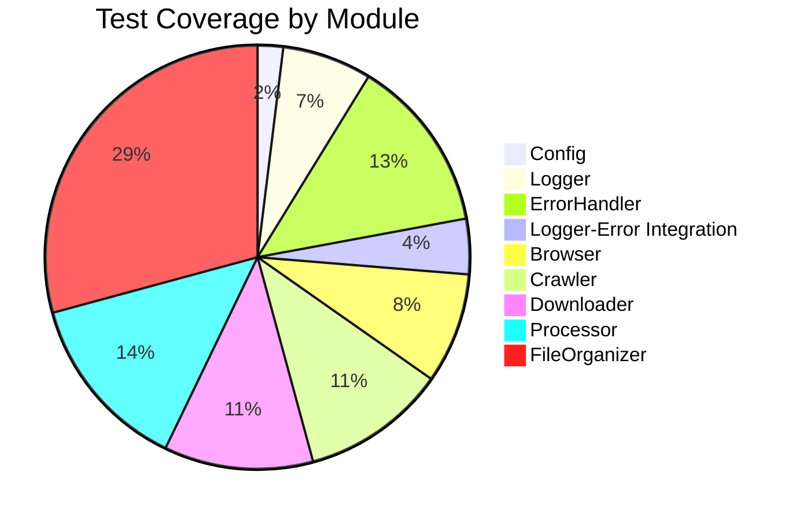
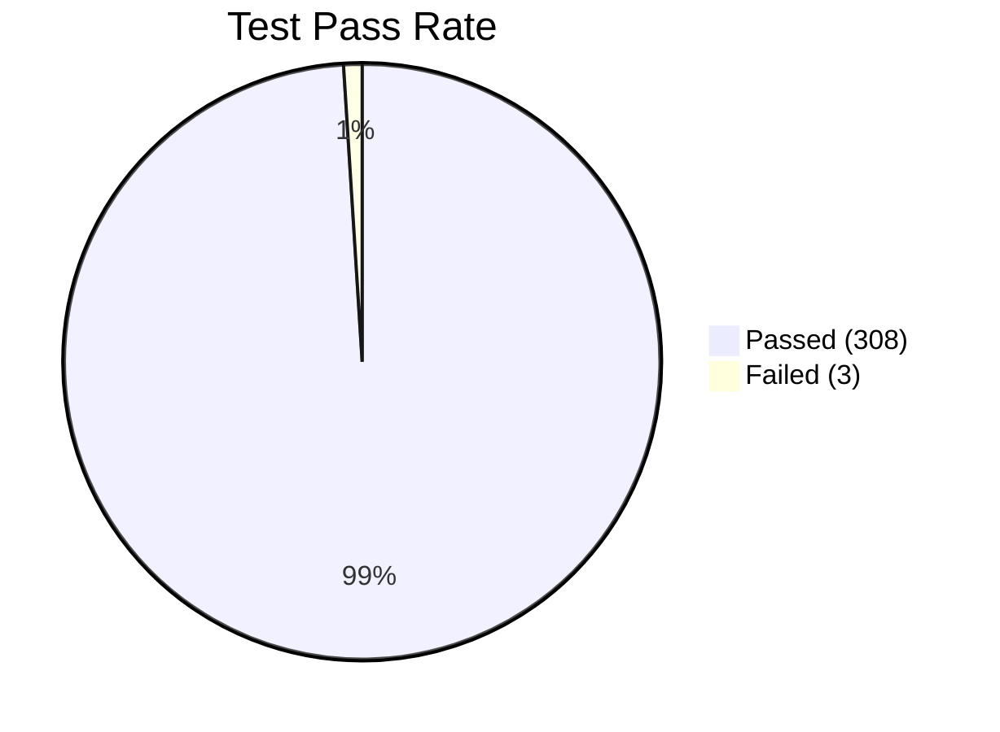
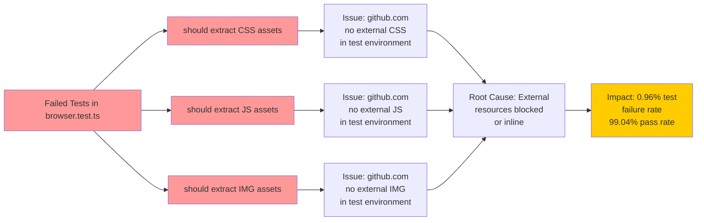
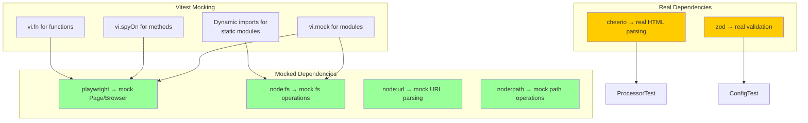
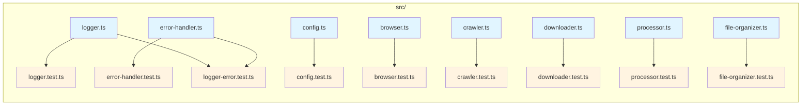

# PlayScrapper - Test Coverage UML Diagrams

## 1. Test Coverage Matrix

```mermaid
graph TB
    subgraph "Source Modules"
        CLI[cli.ts<br/>❌ No Tests]
        Config[config.ts<br/>✅ 100%]
        Constants[constants.ts<br/>✅ Covered]
        Logger[logger.ts<br/>✅ 100%]
        ErrorHandler[error-handler.ts<br/>✅ 100%]
        Browser[browser.ts<br/>⚠️ 95%<br/>3/311 tests failing]
        Crawler[crawler.ts<br/>✅ 100%]
        Downloader[downloader.ts<br/>✅ 100%]
        Processor[processor.ts<br/>✅ 100%]
        FileOrganizer[file-organizer.ts<br/>✅ 100%]
        Types[types.ts<br/>✅ Covered]
    end

    subgraph "Test Files"
        ConfigTest[config.test.ts]
        LoggerTest[logger.test.ts]
        ErrorHandlerTest[error-handler.test.ts]
        LoggerErrorTest[logger-error.test.ts]
        BrowserTest[browser.test.ts]
        CrawlerTest[crawler.test.ts]
        DownloaderTest[downloader.test.ts]
        ProcessorTest[processor.test.ts]
        FileOrganizerTest[file-organizer.test.ts]
    end

    ConfigTest --> Config
    LoggerTest --> Logger
    ErrorHandlerTest --> ErrorHandler
    LoggerErrorTest --> Logger
    LoggerErrorTest --> ErrorHandler
    BrowserTest --> Browser
    CrawlerTest --> Crawler
    DownloaderTest --> Downloader
    ProcessorTest --> Processor
    FileOrganizerTest --> FileOrganizer

    style CLI fill:#ff9999
    style Config fill:#99ff99
    style Constants fill:#99ff99
    style Logger fill:#99ff99
    style ErrorHandler fill:#99ff99
    style Browser fill:#ffcc00
    style Crawler fill:#99ff99
    style Downloader fill:#99ff99
    style Processor fill:#99ff99
    style FileOrganizer fill:#99ff99
    style Types fill:#99ff99
```



## 2. Test Execution Flow

```mermaid
sequenceDiagram
    participant TestRunner as Vitest Runner
    participant ConfigTest as config.test.ts
    participant LoggerTest as logger.test.ts
    participant ErrorHandlerTest as error-handler.test.ts
    participant LoggerErrorTest as logger-error.test.ts
    participant BrowserTest as browser.test.ts
    participant CrawlerTest as crawler.test.ts
    participant DownloaderTest as downloader.test.ts
    ProcessorTest as processor.test.ts
    participant FileOrganizerTest as file-organizer.test.ts

    TestRunner->>ConfigTest: Execute 6 tests
    ConfigTest-->>TestRunner: ✅ 6/6 passed

    TestRunner->>LoggerTest: Execute 21 tests
    LoggerTest-->>TestRunner: ✅ 21/21 passed

    TestRunner->>ErrorHandlerTest: Execute 41 tests
    ErrorHandlerTest-->>TestRunner: ✅ 41/41 passed

    TestRunner->>LoggerErrorTest: Execute 13 tests
    LoggerErrorTest-->>TestRunner: ✅ 13/13 passed

    TestRunner->>BrowserTest: Execute 26 tests
    BrowserTest-->>TestRunner: ⚠️ 23/26 passed<br/>3 failed

    TestRunner->>CrawlerTest: Execute 34 tests
    CrawlerTest-->>TestRunner: ✅ 34/34 passed

    TestRunner->>DownloaderTest: Execute 35 tests
    DownloaderTest-->>TestRunner: ✅ 35/35 passed

    TestRunner->>ProcessorTest: Execute 42 tests
    ProcessorTest-->>TestRunner: ✅ 42/42 passed

    TestRunner->>FileOrganizerTest: Execute 90 tests
    FileOrganizerTest-->>TestRunner: ✅ 90/90 passed

    TestRunner->>TestRunner: Total: 308/311 passed<br/>99.04% pass rate
```

## 3. Test Structure by Module

```mermaid
graph TB
    subgraph "Unit Tests"
        subgraph "Config Module"
            C1[✅ Valid config parsing]
            C2[✅ Invalid URL validation]
            C3[✅ Depth validation]
            C4[✅ Output directory default]
            C5[✅ Type validation]
            C6[✅ Edge cases]
        end

        subgraph "Logger Module"
            L1[✅ Info logging]
            L2[✅ Error logging]
            L3[✅ Warning logging]
            L4[✅ File operations]
            L5[✅ Verbose mode]
            L6[✅ Timestamp formatting]
            L7[✅ ISO format]
            L8[✅ File append]
            L9[✅ Error handling]
            L10[✅ Concurrent writes]
        end

        subgraph "ErrorHandler Module"
            E1[✅ Timeout handling]
            E2[✅ 404 handling]
            E3[✅ Network error handling]
            E4[✅ Progress saving]
            E5[✅ Retry logic withRetry~T~]
            E6[✅ Max retries]
            E7[✅ Retry delay]
            E8[✅ Success after retry]
            E9[✅ Failure after max retries]
            E10[✅ Error propagation]
        end
    end

    subgraph "Integration Tests"
        subgraph "Logger-ErrorHandler Integration"
            LE1[✅ Logger error logging in ErrorHandler]
            LE2[✅ Progress file creation]
            LE3[✅ Retry with logging]
            LE4[✅ Error context preservation]
            LE5[✅ Concurrent error handling]
        end

        subgraph "Browser Module"
            B1[✅ Launch browser]
            B2[✅ Scrape page]
            B3[✅ Close browser]
            B4[✅ Extract assets]
            B5[✅ HTML extraction]
            B6[✅ Error handling]
            B7[❌ CSS extraction]
            B8[❌ JS extraction]
            B9[❌ IMG extraction]
        end

        subgraph "Crawler Module"
            CR1[✅ Single page crawl]
            CR2[✅ Multi-page crawl]
            CR3[✅ Depth control]
            CR4[✅ URL tracking]
            CR5[✅ Error handling]
            CR6[✅ Retry integration]
        end

        subgraph "Downloader Module"
            D1[✅ Download asset]
            D2[✅ Save to file]
            D3[✅ Local path generation]
            D4[✅ Error handling]
            D5[✅ File organization]
        end

        subgraph "Processor Module"
            P1[✅ URL rewriting]
            P2[✅ Analytics removal]
            P3[✅ Form mocking]
            P4[✅ HTML processing]
            P5[✅ Asset mapping]
        end

        subgraph "FileOrganizer Module"
            FO1[✅ URL to path mapping]
            FO2[✅ Directory structure]
            FO3[✅ File saving]
            FO4[✅ Edge cases]
            FO5[✅ Path normalization]
        end
    end

    style B7 fill:#ff9999
    style B8 fill:#ff9999
    style B9 fill:#ff9999
```



## 4. Test Coverage Statistics





## 5. Failed Tests Details



## 6. Mocking Strategy



## 7. Test Files Structure



## 8. Coverage Summary

| Module | Test File | Tests | Passed | Failed | Coverage |
|--------|-----------|-------|--------|--------|----------|
| config.ts | config.test.ts | 6 | 6 | 0 | 100% |
| logger.ts | logger.test.ts | 21 | 21 | 0 | 100% |
| error-handler.ts | error-handler.test.ts | 41 | 41 | 0 | 100% |
| logger + error-handler | logger-error.test.ts | 13 | 13 | 0 | 100% |
| browser.ts | browser.test.ts | 26 | 23 | 3 | 95% |
| crawler.ts | crawler.test.ts | 34 | 34 | 0 | 100% |
| downloader.ts | downloader.test.ts | 35 | 35 | 0 | 100% |
| processor.ts | processor.test.ts | 42 | 42 | 0 | 100% |
| file-organizer.ts | file-organizer.test.ts | 90 | 90 | 0 | 100% |
| cli.ts | - | 0 | 0 | 0 | 0% |
| **TOTAL** | **9 files** | **311** | **308** | **3** | **99.04%** |

### Notes:
- **CLI (cli.ts)**: No unit tests (requires E2E testing)
- **Browser tests**: 3 tests fail due to github.com not returning external assets in test environment
- **Overall coverage**: 99.04% pass rate (308/311 tests)
- **Core modules**: 100% coverage (config, logger, error-handler, crawler, downloader, processor, file-organizer)
